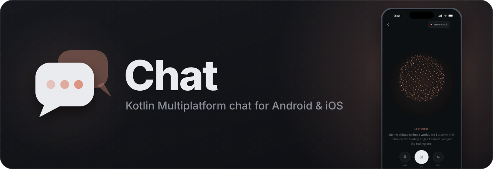
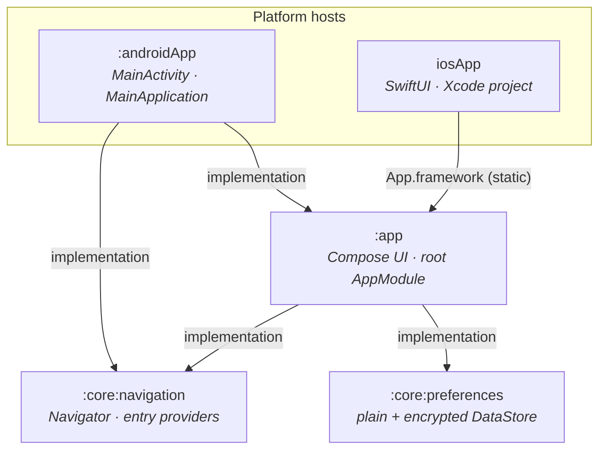

<a id="top"></a>

<div align="center">



<br>
<br>

[](https://kotlinlang.org)
[](https://www.jetbrains.com/compose-multiplatform/)
[](#-getting-started)
[](#-getting-started)


**One Kotlin codebase. Two native apps. Shared UI, compile-time DI, and encrypted storage from day one.**

[Highlights](#-highlights) •
[Architecture](#%EF%B8%8F-architecture) •
[Getting started](#-getting-started) •
[Commands](#%EF%B8%8F-commands) •
[Build logic](#-build-logic) •
[Troubleshooting](#-troubleshooting)

</div>

<br>

> [!NOTE]
> **Status: foundation.** The build system, dependency injection and secure storage are in place.
> The chat experience is being built on top of them, so the app still shows the starter screen.
> The voice mode screen in the banner comes from the design prototype, not from a build of the app.

## ✨ Highlights

<table>
  <tr>
    <td width="50%" valign="top">
      <h3>📱 Shared UI, native hosts</h3>
      The whole interface is Compose Multiplatform in <code>:app</code>. Android renders it from
      <code>MainActivity</code>, and iOS embeds it in SwiftUI through a static <code>App</code> framework.
    </td>
    <td width="50%" valign="top">
      <h3>🧱 Convention-plugin build</h3>
      Five <code>chat.*</code> plugins in <code>build-logic</code> own every SDK level, target and
      dependency set. A module's build file is just its <code>plugins { }</code> block.
    </td>
  </tr>
  <tr>
    <td width="50%" valign="top">
      <h3>💉 Compile-time checked DI</h3>
      Koin annotations plus the Koin compiler plugin generate the graph per target and report
      missing definitions when the code compiles, not at first injection.
    </td>
    <td width="50%" valign="top">
      <h3>🔐 Encrypted preferences</h3>
      <code>:core:preferences</code> ships plain and encrypted <code>DataStore</code> instances backed by
      Android Keystore and the iOS Keychain, with authenticated, versioned ciphertext.
    </td>
  </tr>
  <tr>
    <td width="50%" valign="top">
      <h3>🧭 Modular Navigation 3</h3>
      <code>:core:navigation</code> holds one saved back stack behind a <code>Navigator</code> with
      Navigation 2 style options, and each module adds its screens through an <code>EntryProvider</code>.
    </td>
    <td width="50%" valign="top">
      <h3>⚡ Fast, reproducible builds</h3>
      Configuration cache and build cache are on, versions live in one catalog, and the Gradle
      daemon runs on a pinned Azul Zulu 21 toolchain.
    </td>
  </tr>
</table>

## 🏛️ Architecture



| Module | Role |
| --- | --- |
| [`:androidApp`](androidApp) | The Android application. Starts Koin with `androidContext(...)` and sets `App()` as content. |
| [`iosApp`](iosApp) | The Xcode project. Calls `KoinKt.doInitKoin()` and wraps `MainViewController()` in SwiftUI. |
| [`:app`](app) | Shared Compose Multiplatform UI: `App()` renders the back stack in a `NavDisplay`. Holds the root Koin module, `AppModule`, which `includes` feature and core modules. |
| [`:core:navigation`](core/navigation) | The shared `Navigator`, navigation keys, `EntryProvider` contract and back-stack saving. [Read the module guide →](core/navigation/README.md) |
| [`:core:preferences`](core/preferences) | Singleton `DataStore<Preferences>` for ordinary settings and for credentials. [Read the module guide →](core/preferences/README.md) |

<details>
<summary><b>How startup works on each platform</b></summary>

<br>

| | Android | iOS |
| --- | --- | --- |
| Entry point | `MainApplication.onCreate()` | `iOSApp.init()` |
| Koin start | `startKoin<AppModule> { androidContext(...) }` | `KoinKt.doInitKoin()` → `startKoin { module<AppModule>() }` |
| UI host | `MainActivity` → `setContent { ... }` | `ComposeView` → `MainViewControllerKt.MainViewController()` |
| Composition root | `rememberNavigator(HomeEntry)`, then `App(navBackStack, entryBuilders)` | The same, inside `ComposeUIViewController { ... }` |

Both hosts read the entry builders from `EntriesAggregator`. `MainActivity` injects it with
`by inject()`, and iOS gets it from `KoinPlatform.getKoin()`.

iOS uses the untyped `startKoin` on purpose: with Koin compiler plugin 1.2.1, the typed form in the
iOS compilation reports `KOIN-D002` for valid lookups across Gradle modules. See
[`Koin.kt`](app/src/iosMain/kotlin/br/com/weslleycampos/chat/Koin.kt).

</details>

## 🧰 Tech stack

| Layer | Library | Version |
| --- | --- | --- |
| Language | [Kotlin Multiplatform](https://kotlinlang.org/docs/multiplatform.html) | `2.4.20` |
| UI | [Compose Multiplatform](https://www.jetbrains.com/compose-multiplatform/) · Material 3 | `1.12.1` · `1.12.0-alpha03` |
| Navigation | [Navigation 3](https://developer.android.com/guide/navigation/navigation-3) | `1.1.2` |
| Lifecycle | JetBrains `lifecycle-runtime-compose` · `lifecycle-viewmodel-compose` | `2.11.0` |
| Dependency injection | [Koin](https://insert-koin.io) · Koin compiler plugin | `4.2.2` · `1.2.1` |
| Storage | [AndroidX DataStore](https://developer.android.com/topic/libraries/architecture/datastore) Preferences (Okio) | `1.2.1` |
| Static analysis | [Detekt](https://detekt.dev) + `detekt-formatting` | `1.23.8` |
| Build | Gradle · Android Gradle Plugin | `9.5.1` · `9.1.1` |

Every version lives in [`gradle/libs.versions.toml`](gradle/libs.versions.toml), including the Android
SDK levels (`compileSdk 37`, `targetSdk 37`, `minSdk 29`) and the app version.

## 🚀 Getting started

### Prerequisites

| Tool | Requirement |
| --- | --- |
| ☕ JDK | **21 or newer** to launch Gradle. The build stops early on anything older. |
| 🤖 Android | Android Studio or IntelliJ IDEA with the Kotlin Multiplatform plugin, and Android SDK 37. |
| 🍎 iOS | macOS with Xcode and the iOS 18.2+ SDK. An **Apple silicon** Mac is needed for the simulator, since the only simulator target is `iosSimulatorArm64`. |

> [!TIP]
> The JDK you install only launches Gradle. The build itself runs on the Azul Zulu 21 toolchain pinned in
> [`gradle/gradle-daemon-jvm.properties`](gradle/gradle-daemon-jvm.properties), which Gradle downloads on the
> first build, so that first build needs network access.

### Clone

```bash
git clone git@github.com:weslley-poatek/chat.git
```

```bash
cd chat
```

### 🤖 Run on Android

Pick the `androidApp` run configuration in the IDE toolbar, or build from the terminal:

```bash
./gradlew :androidApp:installDebug
```

### 🍎 Run on iOS

```bash
open iosApp/iosApp.xcodeproj
```

Choose a simulator and press **Run**. The **Compile Kotlin Framework** build phase calls
`./gradlew :app:embedAndSignAppleFrameworkForXcode`, so Xcode builds the shared code for you.

> [!IMPORTANT]
> To run on a physical device, set `TEAM_ID` in [`iosApp/Configuration/Config.xcconfig`](iosApp/Configuration/Config.xcconfig).
> It feeds both the signing team and the bundle identifier.
>
> If Xcode fails with **"Unable to locate a Java Runtime"**, see [Troubleshooting](#-troubleshooting).

## ⌨️ Commands

| Task | Command |
| --- | --- |
| Build the Android debug APK | `./gradlew :androidApp:assembleDebug` |
| Install it on a connected device | `./gradlew :androidApp:installDebug` |
| Shared tests on the Android host | `./gradlew :app:testAndroidHostTest` |
| Shared tests on the iOS simulator | `./gradlew :app:iosSimulatorArm64Test` |
| Preferences tests on the iOS simulator | `./gradlew :core:preferences:iosSimulatorArm64Test` |
| Navigation tests on the Android host | `./gradlew :core:navigation:testAndroidHostTest` |
| Navigation tests on the iOS simulator | `./gradlew :core:navigation:iosSimulatorArm64Test` |
| Static analysis for every module | `./gradlew detekt` |

> [!WARNING]
> Detekt runs with `autoCorrect = true`, so `detekt` and `check` may **rewrite source files**.
> Commit or stash your work first if you want to review the corrections as a separate diff.

## 🧱 Build logic

All shared configuration lives in the [`build-logic`](build-logic/convention/src/main/kotlin) included
build. Each module picks the conventions it needs:

| Convention plugin | What it sets up | `:androidApp` | `:app` | `:core:navigation` | `:core:preferences` |
| --- | --- | :---: | :---: | :---: | :---: |
| `chat.android.application` | AGP application, Compose compiler, SDK levels, app id and version | ✅ | | | |
| `chat.multiplatform.library` | KMP + Android KMP library target, Kotlin serialization, host and device tests, iOS `App` frameworks | | ✅ | ✅ | ✅ |
| `chat.compose.library` | Compose Multiplatform, Material 3, Navigation 3, lifecycle, per-module `Res` class | | ✅ | ✅ | |
| `chat.koin` | Koin compiler plugin, plus runtime and annotations for the module type, and Koin Compose where Compose is on | ✅ | ✅ | ✅ | ✅ |
| `chat.detekt` | Detekt with formatting rules, the shared [`detekt.yml`](detekt.yml) and HTML reports | ✅ | ✅ | ✅ | ✅ |

### Adding a module

**1.** Register it in [`settings.gradle.kts`](settings.gradle.kts):

```kotlin
include(":feature:home")
```

**2.** Apply the conventions in `feature/home/build.gradle.kts`, then declare only what is unique to it:

```kotlin
plugins {
    alias(libs.plugins.chat.multiplatform.library)
    alias(libs.plugins.chat.compose.library) // only for modules with UI
    alias(libs.plugins.chat.koin)
    alias(libs.plugins.chat.detekt)
}
```

**3.** Add its Koin module to the `includes` of [`AppModule`](app/src/commonMain/kotlin/br/com/weslleycampos/chat/AppModule.kt).
A Gradle dependency alone registers nothing.

**4.** If it has screens, depend on `:core:navigation` and bind an `EntryProvider` for each one.
The [navigation guide](core/navigation/README.md#adding-a-screen) walks through it.

Names are derived from the Gradle path, so there is nothing to configure:

| Gradle path | Android namespace | Compose resources class |
| --- | --- | --- |
| `:app` | `br.com.weslleycampos.chat.app` | `br.com.weslleycampos.chat.app.resources.AppRes` |
| `:feature:home` | `br.com.weslleycampos.chat.feature.home` | `br.com.weslleycampos.chat.feature.home.resources.FeatureHomeRes` |

## 🔐 Secure storage

`:core:preferences` exposes two qualified `DataStore<Preferences>` instances. Inject
`@UnencryptedPreferences` for ordinary settings and `@EncryptedPreferences` for credentials that
can be replaced by signing in again.

| | 🤖 Android | 🍎 iOS |
| --- | --- | --- |
| Cipher | AES-256-GCM | AES-256-CBC + HMAC-SHA256, verified before decrypting |
| Key storage | Android Keystore | Keychain, `AfterFirstUnlockThisDeviceOnly` |
| File location | `noBackupFilesDir` | Application Support, excluded from backup |
| Bound to ciphertext | Format version + store name, as AAD | Format version + store name, as AAD |

If a key is lost or the file is corrupt, the encrypted store resets to empty, which the app should
treat as signed out. The [module guide](core/preferences/README.md) covers usage, the byte format,
recovery and DI details.

## 🗂️ Project structure

```text
chat/
├── androidApp/                    🤖 Android entry point
├── app/                           📱 Shared Compose UI and root Koin module
│   └── src/
│       ├── commonMain/            Code for every target
│       ├── androidMain/           Android actuals
│       ├── iosMain/               iOS actuals, MainViewController, initKoin()
│       ├── commonTest/
│       ├── androidHostTest/
│       └── iosTest/
├── core/
│   ├── navigation/                🧭 Navigator, keys and entry providers
│   └── preferences/               🔐 Plain and encrypted DataStore
├── iosApp/                        🍎 Xcode project and SwiftUI host
├── build-logic/
│   └── convention/                🧱 chat.* convention plugins
├── gradle/
│   ├── libs.versions.toml         📦 The single version catalog
│   └── gradle-daemon-jvm.properties
└── detekt.yml                     🧹 Shared static-analysis rules
```

## 🩺 Troubleshooting

<details>
<summary><b>Xcode: "Unable to locate a Java Runtime"</b></summary>

<br>

The Xcode build fails in the **Compile Kotlin Framework** build phase with:

```text
The operation couldn’t be completed. Unable to locate a Java Runtime.
Please visit http://www.java.com for information on installing Java.
```

**Cause.** That phase runs `./gradlew` through `/bin/sh`, and Xcode never loads `~/.zshrc`.
A JDK that only your shell knows about (SDKMAN, jenv, an `export JAVA_HOME` in `.zshrc`) is
invisible to it, so Gradle falls back to the macOS `java` stub, which only sees JDKs
registered with the system. The same build works in your terminal because the terminal
does load `.zshrc`.

**Check.** Run these from the repository root:

```bash
/usr/libexec/java_home -V
```

If it prints `Unable to locate a Java Runtime`, no JDK is registered with macOS and Xcode
cannot build. This reproduces what Xcode sees (no `.zshrc`, minimal `PATH`):

```bash
env -i HOME="$HOME" PATH=/usr/bin:/bin:/usr/sbin:/sbin ./gradlew --version
```

It fails with the same message while the problem exists, and prints the Gradle version once
it is fixed.

**Fix.** Register a JDK (21 or newer) with macOS. Pick one:

- Android Studio's bundled JDK, if you have Android Studio installed. No download needed.
  The link breaks if the app is moved or renamed, so repeat it then:

  ```bash
  mkdir -p ~/Library/Java/JavaVirtualMachines
  ln -s "/Applications/Android Studio.app/Contents/jbr" ~/Library/Java/JavaVirtualMachines/android-studio-jbr.jdk
  ```

- A system-wide Temurin JDK (asks for your admin password):

  ```bash
  brew install --cask temurin@21
  ```

- A JDK you already manage with SDKMAN. SDKMAN's folders are not macOS `.jdk` bundles, so this
  wraps one in a small bundle that points at it. Set `JDK` to a version listed by
  `sdk list java` that is installed:

  ```bash
  JDK=21.0.11-tem
  test -d "$SDKMAN_DIR/candidates/java/$JDK" || echo "Not found: $SDKMAN_DIR/candidates/java/$JDK (stop here)"
  V=${JDK%%-*}
  B=~/Library/Java/JavaVirtualMachines/sdkman-$JDK.jdk
  mkdir -p "$B/Contents/MacOS"
  ln -s "$SDKMAN_DIR/candidates/java/$JDK" "$B/Contents/Home"
  ln -s ../Home/lib/libjli.dylib "$B/Contents/MacOS/libjli.dylib"
  cat > "$B/Contents/Info.plist" <<EOF
  <?xml version="1.0" encoding="UTF-8"?>
  <!DOCTYPE plist PUBLIC "-//Apple//DTD PLIST 1.0//EN" "http://www.apple.com/DTDs/PropertyList-1.0.dtd">
  <plist version="1.0">
  <dict>
    <key>CFBundleIdentifier</key><string>sdkman.$JDK.jdk</string>
    <key>CFBundleName</key><string>SDKMAN $JDK</string>
    <key>CFBundleExecutable</key><string>libjli.dylib</string>
    <key>CFBundlePackageType</key><string>BNDL</string>
    <key>CFBundleInfoDictionaryVersion</key><string>7.0</string>
    <key>JavaVM</key>
    <dict>
      <key>JVMCapabilities</key><array><string>CommandLine</string></array>
      <key>JVMPlatformVersion</key><string>$V</string>
      <key>JVMVendor</key><string>SDKMAN</string>
      <key>JVMVersion</key><string>$V</string>
    </dict>
  </dict>
  </plist>
  EOF
  ```

  The bundle follows that one installed version: if you uninstall it with `sdk uninstall`,
  delete the bundle and repeat this with the version you keep.

Then run the two **Check** commands again: the first must list a JDK and the second must
print a Gradle version. Build from Xcode again afterwards; no project change is needed.

</details>

<br>

<div align="center">

<sub><a href="#top">↑ Back to top</a></sub>

</div>
